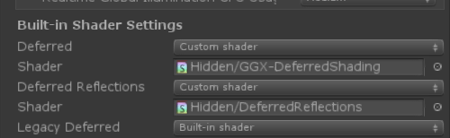

# SubSurface Scattering Skin!

## Features:
* GBuffer based Screen Space SSS.(Deferred shading supported, better performance, SSR, SSAO, contact shadow supported)
* Pre-Integrated skin diffuse.
* GBuffer based post-processing filter.

## Tutorial:
* Replace "(Unity Folder)/Editor/Data/CGIncludes/UnityGBuffer.cginc" by "(Project Folder)/Assets/SkinShader/BuiltinCGINC/UnityGBuffer.cginc".
* Transform the built-in deferred shading shader and built in deferred reflection shader into the custom shader and save it.

* Add SSSSSGBuffer.cs as a singleton in the scene, enable it to use ramp pre-integrated diffuse.
* Use the specific shader provided in the Demo scene onto your own model.

## Limitations:
* Local SSS shaders only support one channel specular color currently, the specular color could only be black-white.
* No single object SSS color support.

## Comming Soon:
* More custom shaders with exciting implements(Skin Tessellation, Hair, Eyes, etc.).
* Better lighting and GI model for soft material.

# 次表面皮肤材质！

## 特点：
* 基于GBuffer的屏幕空间次表面（支持延迟渲染， 具有更高的渲染性能，支持屏幕空间反射，环境光遮蔽， 接触阴影等）。
* 预积分的漫反射计算。
* 基于GBuffer的后处理过滤。

## 教程：
* 请将"(Unity文件夹目录)/Editor/Data/CGIncludes/UnityGBuffer.cginc" 替换为 "(本项目目录)/Assets/SkinShader/BuiltinCGINC/UnityGBuffer.cginc".
* 将默认的deferred shading shader与默认的deferred reflection shader改为图中的自定义shader并保存。

* 添加 SSSSSGBuffer.cs 到场景中任意一个GameObject下，使其成为实例化的单例。
* 使用演示场景中提供的Shader为模型着色。

## 限制
* 仅支持单通道高光，即黑白色高光。
* 暂不支持不同物体的单独次表面模型。

## 下次更新将提供：
* 更多有趣的着色效果（曲面细分，毛发，眼球等）。
* 更好的直接光照模型和全局光照模型。